## MCCLK
### Dataset
- Book-Crossing
   - book 
- MovieLens-1M
- LastFM
- Metric
  - CTR: AUC, F1
  - top-K: Recall@K∈{5, 10, 20, 50, 100}
- 适用数据：sparse, interaction + attribute data

以下是几个比较老的模型：
## MKR
### Overview
- [Multi-Task Feature Learning for Knowledge Graph Enhanced Recommendation](https://recbole.io/docs/user_guide/model/knowledge/mkr.html)

- 结合KG embedding + 推荐两个任务
  - connected by Cross&compress Unit
    - Cross: item和entity做cross product，生成交叉特征矩阵
    - Compress: 两种cross product加权，输出到下一层
  - Recommender模块，KG模块
    - L层MLP后做Cross&compress

### Dataset
- MovieLens-1M
- Book-Crossing
- LastFM
- Bing-News
- Metric
  - CTR: AUC, Accuracy
  - top-K: Precision@K={2, 5, 10, 20, 50}
- 适用数据：sparse, side info（文本，e.g. 电影/图书名称，新闻标题）

## KGCN
### Overview
- [Knowledge Graph Convolutional Networks for Recommender](https://recbole.io/docs/user_guide/model/knowledge/kgcn.html)
- 和之前的工作大同小异
  - 基本Pipeline：
    - 聚合neighbor信息（各种aggregator，GNN）
    - 建模高阶关系（multiple-hop）
    - 定义score机制计算概率，e.g. MLP, 内积

### Dataset
- MovieLens-20M
- Book-Crossing
- LastFM
- Metric
  - AUC
  - F1
  - Recall@K={1, 2, 5, 10, 20, 50, 100}
- 适用数据：与前面几个模型相同

## KGNNLS
### Overview
- [Knowledge-aware Graph Neural Networks with Label Smoothness Regularization for Recommender Systems](https://recbole.io/docs/user_guide/model/knowledge/kgnnls.html)

- 将KG转换为user-specific的加权图，用GNN计算每个user对应的item embedding
  - 把KG看作无向图
  - 边权重可训练
- 标签平滑假设：使用标签平滑正则化，确保知识图谱中相邻item有相似的用户相关性label
  - 相当于图上的标签传播
  - 把某一item看作unlabeled
    - 用其他所有实体信息predict出一个label
    - 在与实际label做cross entropy作为正则项

### Dataset
- MovieLens-20M (movie)
- Book-Crossing (book)
- LastFM (music)
- Dianping-Food (restaurant)
  - 大众点评数据
- Metric
  - top-k: Recall@{2, 10, 50, 100}
  - CTR: AUC
- 适用数据：交互数据，实体关系

# Context-aware
## EulerNet
### Overview
- [Adaptive Feature Interaction Learning via Euler’s Formula for CTR Prediction](https://recbole.io/docs/user_guide/model/context/eulernet.html)

- 用欧拉公式在复向量空间中建模特征交互
  - exponential -> 模和相位linear combination
- 统一捕捉显式和隐式交互，相互增强
- 自适应地学习特征交互阶数

### Dataset
- Criteo
  - 7天用户日志，CTR
- Avazu
  - CTR as well
- MovieLens-1M
- Metric
  - AUC
  - Logloss
- 适用数据：稀疏，高维特征数据（e.g. 用户行为日志中提取的多字段特征）

## FiGNN
### Overview
- [Modeling Feature Interactions via Graph Neural Networks for CTR Prediction](https://recbole.io/docs/user_guide/model/context/fignn.html)

- 解决问题：现有方法简单拼接字段embedding
- 多字段特征表示为图
  - raw feature先过self-attn
  - 随后接传统GNN pipeline
    - 状态聚合 -> 状态更新（GRU，残差）

### Dataset
- Criteo
- Avazu
- Metric
  - AUC
  - Logloss
- 任务：CTR
- 适用数据：
  - 多字段分类特征数据
  - 稀疏，高维特征
  - 正负样本不平衡

## KD_DAGFM
### Overview
- [Directed Acyclic Graph Factorization Machines for CTR Prediction via Knowledge Distillation](https://recbole.io/docs/user_guide/model/context/kd_dagfm.html).

- “基于知识蒸馏的有向无环图因子分解机”
- 用知识蒸馏从复杂的教师模型向轻量级学生模型传递知识
  - loss为均方误差
- 用dp思想传播hidden state
  - 每个k阶特征交互可以对应到第一层的唯一路径
  - 每个传播层，每个节点聚合所有邻居的状态

- 改进模型：KD-DAGFM+
  - 用于蒸馏显式和隐式特征交互
  - 最后加MLP
  - 教师模型使用xDeepFM，DCNV2，AutoInt+，FiBiNet

### Dataset
- Criteo
  - CTR benchmark
- Avazu
- MovieLens-1M
- WeChat
- Metric
  - AUC
  - Log Loss
- 适用数据：
  - CTR相关
    - u-i交互，用户画像，item特征
    - 大规模工业数据
    - 高维，稀疏，noisy

## AutoInt
### Overview
- [Automatic Feature Interaction Learning via Self-Attentive Neural Networks](https://recbole.io/docs/user_guide/model/context/autoint.html)

- Attention is all you need!
- 把数值和分类特征映射到同一低维空间
- 多头自注意力，残差连接

### Dataset
- Criteo
- Avazu
- KDD12
  - KDDCup 2012
- MovieLens-1M
- Metric
  - AUC
  - Logloss
- 适用数据：
  - 稀疏，高维
  - 包含数值和分类特征

## DCN
### Overview
- [Deep & Cross Network for Ad Click Predictions](https://recbole.io/docs/user_guide/model/context/dcn.html)

- Deep: MLP
- Cross Network: 每一层显式应用特征交叉，自动计算所有可行的特征组合
- Scalability↑；发现New item

### Dataset
- Criteo
- Metric
  - Logloss
- 适用数据：和上述几个模型相似

## DCN V2
### Overview
- 对DCN的工业级应用改进
- 用低秩结构近似特征交叉，实现更好的性能和延迟的rade-off
- 混合专家架构（MoE），把矩阵分解到多个子空间中，再用gating机制聚合

### Dataset
- Criteo
- MovieLen-1M
- Metric
  - Logloss
  - AUC
- 适用数据：
  - 大型稀疏特征，web-scale生产数据
  - 低秩结构
    - 权重矩阵具有较大的奇异值差距 / 快速的spectrum decay模式
  - 其他相似

## DIEN
### Overview
- [Deep Interest Evolution Network for Click-Through Rate Prediction](https://recbole.io/docs/user_guide/model/context/dien.html)

- 解决问题：
  - 用户行为背后的隐藏兴趣
  - 兴趣随时间变化
- w/ sequential model
- AUGRU: GRU with attentional update gate
  - 用注意力得分缩放更新门的所有维度，确保与目标item关系较弱的兴趣对隐藏状态的影响较小
  

### Dataset
- Amazon
  - Books
  - Electronics
- Industrial Dataset
- Metric
  - AUC
- 适用数据：
  - 用户行为数据
  - 多样特征类别
  - 目标商品点击信息

## DIN
### Overview
- [Deep Interest Network for Click-Through Rate Prediction](https://recbole.io/docs/user_guide/model/context/din.html)

- 固定长度表达能力不强，与candidate ad无关
- 局部激活单元（local activation unit）
  - 自适应地从用户历史行为中学习ad-specific的兴趣表示
- Two techniques:
  - 小批量正则化
    - 只计算每个mini-batch中出现的特征参数的L2范数
  - 数据自适应激活函数
    - Dice
    - PReLU的推广
    - 根据输入数分布自适应调整整流点（均值）
  
### Dataset
- Amazon(Electronics)
- MovieLens
- Alibaba
- Metric
  - AUC
  - RelaImpr (relative improvement)
  
- 适用数据：
  - pratical: 阿里广告系统
  - 大规模工业级稀疏数据

## WideDeep
Previously discussed 

## DSSM
- 双塔召回
- Previously discussed 
- Pipeline:
  - 投影（高->低维）
  - MLP
  - 余弦相似，softmax
- Metric
  - NDCG@{1, 3, 10}

## PNN
### Overview
- [Product-based neural networks for user response prediction](https://recbole.io/docs/user_guide/model/context/pnn.html)
- 用乘积层来捕捉字段之间的交互模式
  - Inner product
  - Outer product
  
### Dataset
- Criteo
- iPinYou
- Metric
  - AUC
  - RIG (Relative Information Gain)
  - Log Loss
  - RMSE
- 适用数据：多字段，categorical，高维one-hot特征

## FNN
### Overview
- [Deep Learning over Multi-field Categorical Data](https://recbole.io/docs/user_guide/model/context/fnn.html)
- 最简单的raw MLP
- FM的objective
### Dataset
- iPinYou
- Metric
  - AUC
- 适用数据：广告

以下为FM系的模型：
## FFM
### Overview
- [Field-aware Factorization Machines for CTR Prediction](https://recbole.io/docs/user_guide/model/context/ffm.html)
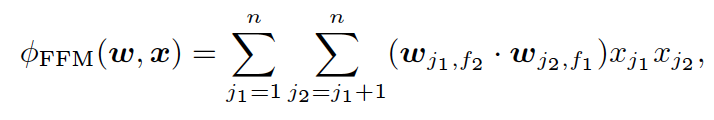
- 在传统FM基础上，不是直接学习feature间pairwise的权重，而是学字段间权重

### Dataset
- Criteo
- Avazu
- Metric
  - logloss
- 适用数据：
  - 只适合分类特征，并可转换为binary特征的数据

## FwFM
### Overview
- [Field-weighted Factorization Machines for Click-Through Rate Prediction in Display Advertising](https://recbole.io/docs/user_guide/model/context/fwfm.html)
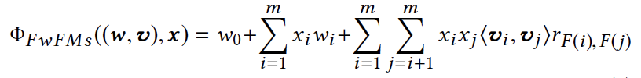
- 就是在FFM基础上多加了一个field之间的weight，"field-weighted"

### Dataset
- Criteo
- Oath
  - 两周广告点击日志
- Metric
  - AUC
- 适用数据：多字段分类数据

## AFM
### Overview
- [Attentional Factorization Machines: Learning the Weight of Feature Interactions via Attention Networks](https://recbole.io/docs/user_guide/model/context/afm.html)
- 用attention学习各feature interaction的重要性

### Dataset
- Frappe
- MovieLens
- Metric
  - RMSE

## DeepFM
### Overview
- [DeepFM: A Factorization-Machine based Neural Network for CTR Prediction](https://recbole.io/docs/user_guide/model/context/deepfm.html)
- DNN + FM（简单加和再过sigmoid）

### Dataset
- Criteo
- Company∗
  - App Store游戏中心，连续7天的用户点击记录
- Metric
  - AUC
  - Logloss
- 适用数据：高维稀疏，CTR

## xDeepFM
### Overview
- [eXtreme Deep Factorization Machine, Combining Explicit and Implicit Feature Interactions for Recommender Systems](https://recbole.io/docs/user_guide/model/context/xdeepfm.html)
- 显式生成特征交互
- CIN:
  - 每一层隐藏层的输出依赖上层和额外输入，类似RNN
  - 滤波器沿embedding维度滑动，生成特征图，类似CNN
  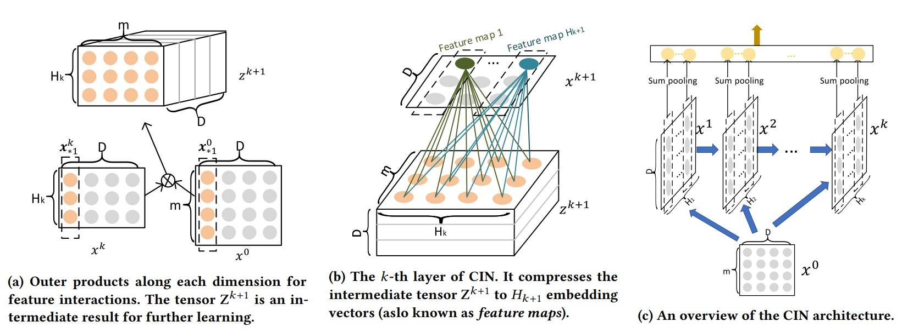
- CIN + Deep: xDeepFM
  - 想法和DeepFM，Wide&Deep非常类似

### Dataset
- Criteo
- Dianping
- Bing News
- Metric
  - AUC
  - Logloss
- 适用数据：
  - numerical & categorical混合
  - 缺乏明确时空上的相关性

## NFM
### Overview
- [Neural Factorization Machines for Sparse Predictive Analytics](https://recbole.io/docs/user_guide/model/context/nfm.html)
- 显式捕捉bi-interaction（二阶交互）->再过多层FFN

### Dataset
- Frappe
  - app用户日志
- MovieLens
- Metric
  - RMSE
- 适用数据：稀疏特征，categorical

# Genearal Recommendation
## DiffRec
### Overview
- [Diffusion Recommender Model](https://recbole.io/docs/user_guide/model/general/ldiffrec.html)
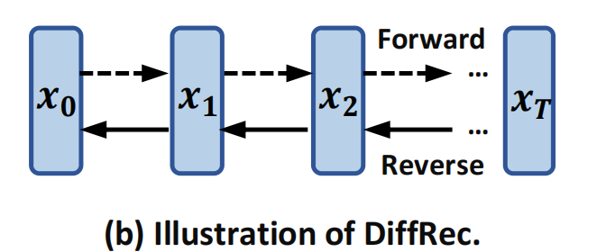
- 逐步用高斯噪声腐蚀用户交互历史，然后迭代恢复原始交互
  - 前向过程显著降低噪声尺度，保留用户个性化信息
- Inference: 用重构后的$\hat{x_0}$分布计算probability，推荐排名靠前的商品
- 两个扩展：
  - L-DiffRec
    - 用k-means对物品进行聚类，压缩维度
  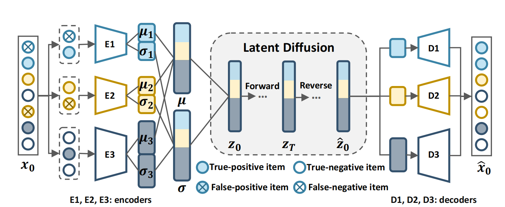
  - T-DiffRec
    - time-aware reweighting
    - 时序靠后的交互赋予更大权重
- 有点类似data augmentation？

### Dataset
- Amazon-book
- Yelp
- ML-1M
- Metric
  - Recall@k
  - NDCG@k
  - k=10, 20
- 适用数据：
  - 高噪声用户交互
  - large-scale
  - 用户偏好随时间变化

## NCL
### Overview
- [Improving Graph Collaborative Filtering with Neighborhood-enriched Contrastive Learning](https://recbole.io/docs/user_guide/model/general/ncl.html)
- A+B: Graph CF + CL
  - 将结构和语义邻居纳入图协同过滤，做对比学习
- GNN:
  - 归一化聚合，BPR loss（pairwise）
- 和邻居做CL
  - Structural：所有邻居平等对待
  - Semantic：仅考虑聚类之后在同prototype之下的邻居

### Dataset
- MovieLens1M
- Yelp
- Amazon Books
- Gowalla
- Alibaba-iFashion
- Metric
  - Recall@N
  - NDCG@N
  - N = 10, 20, 50
- 适用数据：隐式反馈，sparse，nothing specific

## SimpleX
### Overview
- [A Simple and Strong Baseline for Collaborative Filtering](https://recbole.io/docs/user_guide/model/general/simplex.html)
- 关注点：loss function & 负采样比例
  - **简单**鲁棒的baseline
- CCL
  - cosine contrastive loss
  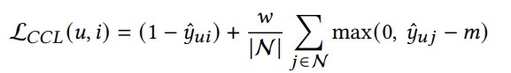 
  - m: margin; 正样本 + neg sample
- 基本pipeline：
  - 所有交互的items做aggregation
    - avg
    - attn
  - 聚合的item embed和user embed加权加和
  - 和candidate item余弦相似，最后计算出CCL

### Dataset
- Amazon-Books
- Yelp18
- Gowalla
- further test:
  - Amazon-CDs, Amazon-Movies, Amazon-Beauty
  - CiteUlikeA, Movielens-1M
- Metric
  - Recall@20
  - NDCG@20
  - wide range of comparison
- 适用数据：
  - large-scale
  - 计算资源有限场景

## NCEPLRec
### Overview
- [Noise Contrastive Estimation for One-Class Collaborative Filtering](https://recbole.io/docs/user_guide/model/general/nceplrec.html)
- 解决问题：总是推荐popular items，缺乏个性化推荐
- NCE: Noise Contrastive Estimation
  - 平衡observed & unobserved
- NS-AutoRec
  - 通过负采样训练嵌入层
  - 仅考虑重构error，NS作正则项
- NCE-AutoRec
  - unobserved interaction的预测期望用负采样期望近似
  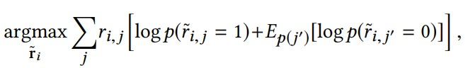

### Dataset
- Goodbooks
- MovieLens-20M
- Netflix
- Yahoo
- Metric
  - R-Precision, NDCG, MAP@K,
Precison@K, Recall@K and F1-score@K
- 适用数据：
  - large-scale, real-life
  - implicit feedback
  - 用户偏好多样化

## ADMMSLIM
### Overview
- [Sparse Recommendations for Many Users](https://recbole.io/docs/user_guide/model/general/admmslim.html)
- by Netflix
- 优化原始Slim目标函数，训练时间与用户数无关，可扩展到大规模用户群体
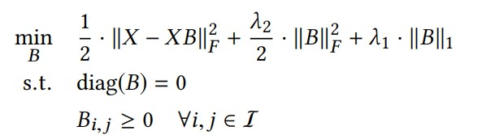
- $B$涉及多个函数和约束，重新定义为等效优化问题，前两项$f(B)$，最后一项$g(C)$, s.t. $B=C$
- 这个constraint用拉格朗日乘数约束，然后这个优化用类似ALS的方法交替更新$B$和$C$（有闭式解）
  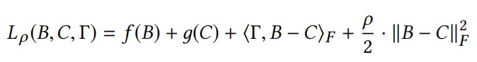
- 可调整各约束和正则项修改目标函数，灵活，提供ablation
- 优点：转化为优化问题，收敛快，scalability

### Dataset
- ML-20M
- Netflix Prize
- Million Song Data(MSD)
- Metric
  - Recall@20
  - Recall@50
  - NDCG@100
- 适用数据：
  - 大量用户
  - 冷启动
  - catalog size > # user

## SGL
### Overview
- [Self-supervised Graph Learning for Recommendation](https://recbole.io/docs/user_guide/model/general/sgl.html)
- 解决问题：
  - 监督信号稀疏
  - 数据分布偏向高度节点
  - prone to noise
- 数据增强方法：
  - 节点dropout
  - 边dropout
  - random walk
- CL: 最大化同一节点不同视图间的一致性
- MTL: 总loss = cross-entropy + CL loss + regularizatoin

### Dataset
- Yelp2018
- Amazon-Book
- Alibaba-iFashion
- Metric
  - Recall@20
  - NDCG@20
- 适用数据：
  - 数据分布biased
  - observed interaction高噪

## SLIMElastic
### Overview
- [Sparse Linear Methods for Top-N Recommender Systems](https://recbole.io/docs/user_guide/model/general/slimelastic.html)
- Refer to [ADMMSLIM](#admmslim)
### Dataset
- 购买交易记录
  - ccard
  - ctlg2
  - ctlg3
  - ecmrc
- 评分数据
  - BX
  - ML10M
  - Netflix
  - Yahoo
- Metric
  - HR
  - ARHR
    - 对每个用户命中以位置倒数加权：
    $\frac{1}{\#users}\sum_{i\in hit} \frac{1}{p_i}$
- 适用数据：purchase, rating

### EASE
### Overview
- [Embarrassingly Shallow Autoencoders for Sparse Data](https://recbole.io/docs/user_guide/model/general/ease.html)
- 在[SLIM](#admmslim)基础上，drop掉非负约束和L1正则
- 同样提供闭式解（形式简单），方法和ADMMSLIM略有不同
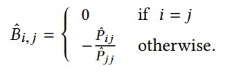 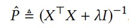

### Dataset
- ML-20M
- Netfix Prize
- Million Song Data (MSD)
- Metric
  - Recall@{20, 50}
  - NDCG@100
- 适用数据：
  - 个性化相关性高，更好推荐长尾item
  - sparse, implicit, etc.
  

## RecVAE
### Overview
- [A New Variational Autoencoder for Top-N Recommendations with Implicit Feedback](https://recbole.io/docs/user_guide/model/general/recvae.html)
- Auto Encoder Paradigm
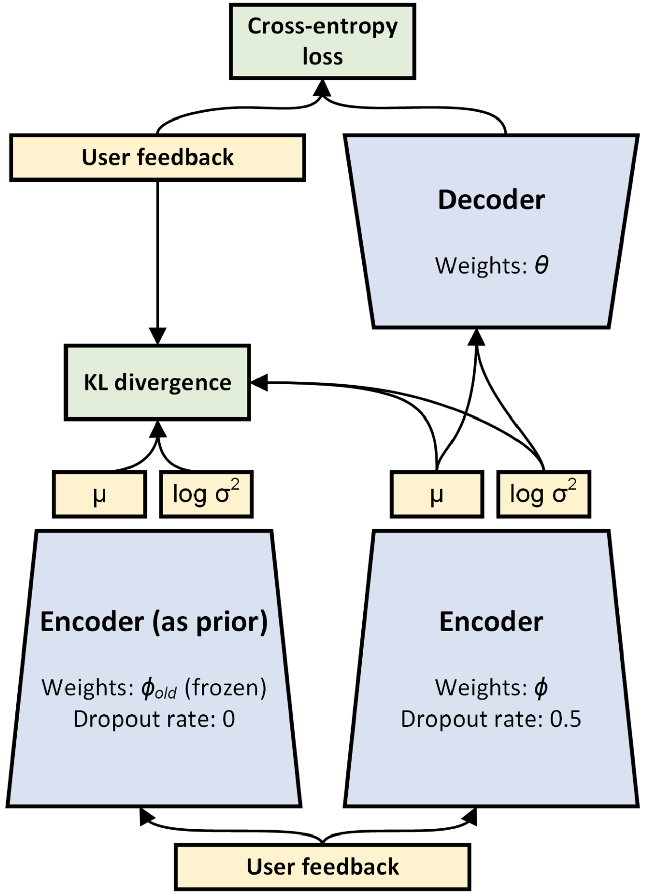
- 把传统VAE的高斯分布改为多项式分布
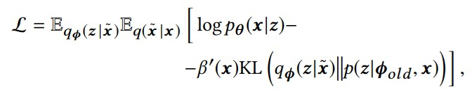
- 把原始的ELBO改为去噪VAE的形式（体现在期望上）
- 复合先验：标准高斯与上一epoch后验近似（$q_\phi(z\mid x)$）的weighted sum
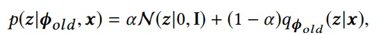
- 超参$\beta$不再是$\beta$-VAE中的常数，而是与当前用户interaction数量成正比（体现在$\beta'(x)$）
- 类似ALS，user和item embedding交替进行

### Dataset
- MovieLens-20M
- Netflix Prize
- Million Songs
- Metric
  - Recall@{20, 50}
  - NDCG@100
- 适用数据：
  - 电商，内容推荐等隐式反馈场景
  - 处理稀疏，噪声

## RaCT
### Overview
- [Towards Amortized Ranking-Critical Training for Collaborative Filtering](https://recbole.io/docs/user_guide/model/general/ract.html)
- 借鉴RL中Actor-Critic（玩家-评委）的想法
  - Critic：近似排名指标
  - Actor：针对指标优化
- 训练方法：
  - 用MLE预训练actor网络，standard in VAE
    - $\mathbb{E}_{q_{\phi}(z\mid x)} \log p_\theta(x\mid z)$
  - 预训练critic网络，最小化MSE（w/ groud truth）
- 类似GAN，actor as G, critic as D

### Dataset
- ML-20M
- Netflix
- MSD
- Metric
  - R@20
  - R@50
  - NDCG@100
- 适用数据：implicit, large-scale, sparse

## NNCF
### Overview
- [A Neural Collaborative Filtering Model with Interaction-based Neighborhood](https://recbole.io/docs/user_guide/model/general/nncf.html)
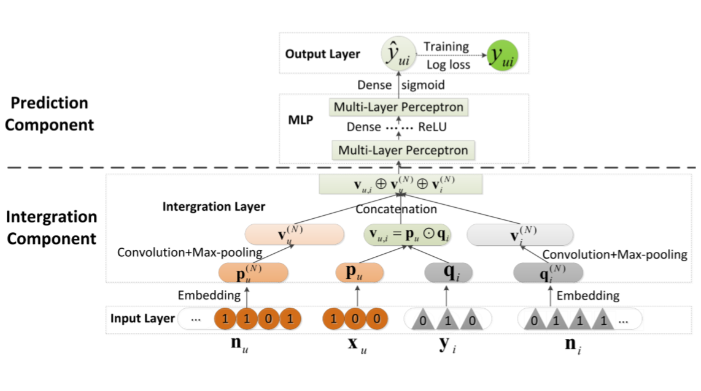
- 增强局部信息利用
- 编码领域信息：
  - 在邻居隐向量上卷积再Max-pooling
- 全局和局部隐向量concat在一起，再过MLP
- 想法非常trivial

### Dataset
- Delicious
  - 社交书签网络服务
- MovieLens
- Rossmann
  - 药店销售记录，kaggle competition
- 适用数据：implicit, sparse, same with traditional CF

## ENMF
### Overview
- 负采样不够鲁棒，不易优化
- 从整个训练数据学习神经模型，w/o sampling
- 提出三个优化techniques：
  - User-based optimization method (ENMF-U)
    - weighted regression loss
    - user batch（横向）
    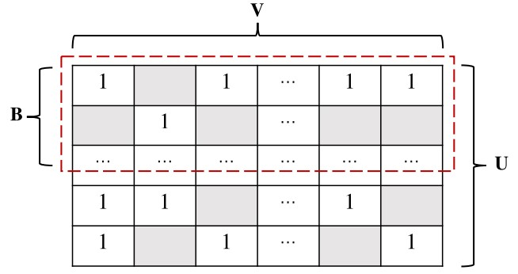
    - 把loss分为正数据损失$\mathcal{L}_1^P(\Theta)$ & 所有数据损失$\mathcal{L}_1^A(\Theta)$
    - 优化：nested sum的重排
    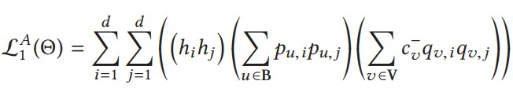
  - Item-based optimization method (ENMF-I)
    - item batch（纵向）
    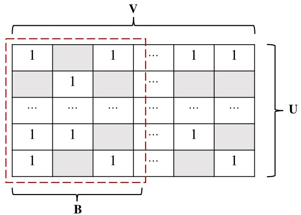
  - Alternating-based optimization method (ENMF-A)
    - motivated by ALS，交替优化user和item

### Dataset
- Ciao
  - 购物评分
- Epinions
- Movielens
- Metric
  - HR
  - NDCG
- 适用数据：large-scale, implicit

## CDAE