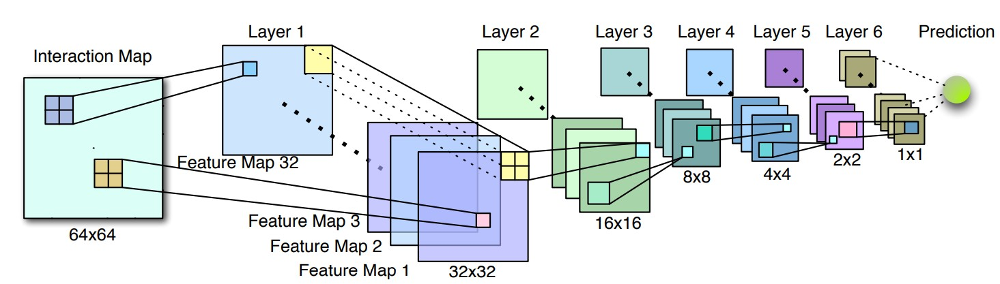

# Recbole推荐算法综述
<!-- ## MCCLK
### 数据集
- Book-Crossing
   - book 
- MovieLens-1M
- LastFM
- Metric
  - CTR: AUC, F1
  - top-K: Recall@K∈{5, 10, 20, 50, 100}
- 适用数据：sparse, interaction + attribute data -->

# Knowledge-based Recommendation
## MKR
### 模型介绍
- [Multi-Task Feature Learning for Knowledge Graph Enhanced Recommendation](https://recbole.io/docs/user_guide/model/knowledge/mkr.html)

- 结合知识图谱embedding以及推荐两个任务
  - 由图中所示的Cross&compress Unit连接
    - Cross: item和entity做叉乘，生成交叉特征矩阵
    - Compress: 两种叉乘结果加权，输出到下一层
  - 两种模块：Recommender（推荐）模块，KG（知识图谱）模块
    - L层MLP后进行Cross&compress

### 数据集
- MovieLens-1M
- Book-Crossing
- LastFM
- Bing-News
- Metric
  - CTR: AUC, Accuracy
  - top-K: Precision@K={2, 5, 10, 20, 50}
- 适用数据：稀疏， 附加信息（文本，e.g. 电影/图书名称，新闻标题）

## KGCN
### 模型介绍
- [Knowledge Graph Convolutional Networks for Recommender](https://recbole.io/docs/user_guide/model/knowledge/kgcn.html)
- 基本流程：
  - 聚合邻域信息（各种聚合函数，GNN）
  - 建模高阶关系，多层跳跃（multiple-hop）
  - 定义得分机制计算概率，e.g. MLP, 内积

### 数据集
- MovieLens-20M
- Book-Crossing
- LastFM
- Metric
  - AUC
  - F1
  - Recall@K={1, 2, 5, 10, 20, 50, 100}
- 适用数据：与前面几个模型相同

## KGNNLS
### 模型介绍
- [Knowledge-aware Graph Neural Networks with Label Smoothness Regularization for Recommender Systems](https://recbole.io/docs/user_guide/model/knowledge/kgnnls.html)

- 将知识图谱转换为用户特定的加权图，用GNN计算每个用户对应的item embedding
  - 把知识图谱看作无向图
  - 边权重可训练
- 标签平滑假设：使用标签平滑正则化，确保知识图谱中相邻item有相似的用户相关性标签
  - 相当于图上的标签传播
  - 把某一item看作未标记数据
    - 用其他所有实体信息预测出一个标签
    - 再与实际标签做交叉熵作为正则项

### 数据集
- MovieLens-20M（电影）
- Book-Crossing（书籍）
- LastFM（音乐）
- Dianping-Food（餐馆）
  - 大众点评数据
- Metric
  - top-k: Recall@{2, 10, 50, 100}
  - CTR: AUC
- 适用数据：交互数据，实体关系

# Context-aware recommendation
"Context-aware"：利用上下文信息补充单一的用户-项目交互信息
## EulerNet
### 模型介绍
- [Adaptive Feature Interaction Learning via Euler’s Formula for CTR Prediction](https://recbole.io/docs/user_guide/model/context/eulernet.html)

- 用欧拉公式在复向量空间中建模特征交互
  - 把指数转化为模和相位线性组合：
  
- 统一捕捉显式和隐式交互，相互增强
- 自适应地学习特征交互阶数

### 数据集
- Criteo
  - 7天用户日志，CTR
- Avazu
  - 同样也是CTR的benchmark
- MovieLens-1M
- Metric
  - AUC
  - Logloss
- 适用数据：稀疏，高维特征数据（e.g. 用户行为日志中提取的多字段特征）

## FiGNN
### 模型介绍
- [Modeling Feature Interactions via Graph Neural Networks for CTR Prediction](https://recbole.io/docs/user_guide/model/context/fignn.html)

- 解决问题：现有方法简单拼接字段embedding
- 多字段特征表示为图
  - 原始特征先过自注意力模块
  - 随后接上传统GNN模块，主要包括：
    - 状态聚合
    - 状态更新（使用GRU，残差等建模序列信息）

### 数据集
- Criteo
- Avazu
- Metric
  - AUC
  - Logloss
- 任务：CTR
- 适用数据：
  - 多字段分类特征数据
  - 稀疏，高维特征
  - 正负样本不平衡

## KD_DAGFM
### 模型介绍
- [Directed Acyclic Graph Factorization Machines for CTR Prediction via Knowledge Distillation](https://recbole.io/docs/user_guide/model/context/kd_dagfm.html)

- 基于知识蒸馏的有向无环图因子分解机
- 用知识蒸馏从复杂的教师模型向轻量级学生模型传递知识
  - 损失为均方误差
- 用动态规划思想传播隐藏状态
  - 每个k阶特征交互可以对应到第一层的唯一路径
  - 每个传播层，每个节点聚合所有邻居的状态

- 改进模型：KD-DAGFM+
  - 用于蒸馏显式和隐式特征交互
  - 最后增加MLP
  - 教师模型（较为复杂）使用xDeepFM，DCNV2，AutoInt+，FiBiNet

### 数据集
- Criteo
  - CTR benchmark
- Avazu
- MovieLens-1M
- WeChat
- Metric
  - AUC
  - Log Loss
- 适用数据：
  - CTR相关数据
    - 用户-项目交互，用户画像，item特征
    - 大规模工业数据
    - 高维，稀疏，噪声数据

## AutoInt
### 模型介绍
- [Automatic Feature Interaction Learning via Self-Attentive Neural Networks](https://recbole.io/docs/user_guide/model/context/autoint.html)

- Attention is all you need!
- 把数值和分类特征映射到同一低维空间
- 多头自注意力，残差连接

### 数据集
- Criteo
- Avazu
- KDD12
  - KDDCup 2012
- MovieLens-1M
- Metric
  - AUC
  - Logloss
- 适用数据：
  - 稀疏，高维
  - 包含数值和分类特征的数据

## DCN
### 模型介绍
- [Deep & Cross Network for Ad Click Predictions](https://recbole.io/docs/user_guide/model/context/dcn.html)

- Deep部分: MLP
- Cross网络部分: 每一层显式应用特征交叉，自动计算所有可行的特征组合
- 有较好的可扩展性，可以用于发现新item
### 数据集
- Criteo
- Metric
  - Logloss
- 适用数据：与上述几个模型相似，稀疏、高维数据

## DCN V2
### 模型介绍
- 对DCN的工业级应用改进
- 用低秩结构近似特征交叉，实现更好的性能和延迟的trade-off
- 使用混合专家架构（MoE），把矩阵分解到多个子空间中，再用门控机制聚合

### 数据集
- Criteo
- MovieLen-1M
- Metric
  - Logloss
  - AUC
- 适用数据：
  - 大型稀疏特征，网络规模的生产数据
  - 低秩结构
    - 特征：权重矩阵具有较大的奇异值差距
  - 其他与DCN相似

## DIEN
### 模型介绍
- [Deep Interest Evolution Network for Click-Through Rate Prediction](https://recbole.io/docs/user_guide/model/context/dien.html)

- 解决问题：
  - 需要提取用户行为背后的隐藏兴趣
  - 用户的兴趣随时间变化
- 使用序列模型为用户行为建模
- AUGRU: 使用注意力更新门的 GRU
  - 用注意力得分缩放更新门的所有维度，确保与目标item关系较弱的兴趣对隐藏状态的影响较小
  

### 数据集
- Amazon
  - Books
  - Electronics
- Industrial Dataset
- Metric
  - AUC
- 适用数据：
  - 用户行为数据
  - 多样特征类别
  - 目标商品点击信息

## DIN
### 模型介绍
- [Deep Interest Network for Click-Through Rate Prediction](https://recbole.io/docs/user_guide/model/context/din.html)

- 解决问题：固定长度的embedding表达能力不强，与候选项目（e.g. 广告）关联度不高
- 重要局部激活单元（local activation unit）
  - 自适应地从用户历史行为中学习广告专用的兴趣表示
  - 注意力为权重的加权和，考虑用户和目标广告的关联度
- 两项优化技术:
  - 小批量正则化
    - 只计算每个mini-batch中出现的特征参数的L2范数
  - 数据自适应的激活函数
    - Dice
    - PReLU的推广
    - 根据输入数分布自适应调整整流点（均值）
  
### 数据集
- Amazon(Electronics)
- MovieLens
- Alibaba
- Metric
  - AUC
- 适用数据：
  - 工业界使用: 阿里广告系统
  - 大规模工业级稀疏数据

## WideDeep
### 模型介绍
- [Wide & Deep Learning for Recommender Systems](https://recbole.io/docs/user_guide/model/context/widedeep.html)

- Wide: 叉乘特征变换的**线性**模型
- Deep: 稀疏特征的前馈网络
- 结合**记忆**和**泛化**的优势搭建推荐系统
  - 记忆：通过叉乘记忆特征交互，利用历史数据的相关性
  - 泛化：通过低维密集embedding泛化到未出现的特征组合
- 应用场景：Google Play

### 数据集
- 使用Google收集的用户和应用商店app的交互数据
- Metric
  - AUC
- 适用数据：
  - 稀疏数据，移动应用商店系统
  - 可包含各种特征组合，e.g. 设备信息，应用统计信息

## DSSM
### 模型介绍
- 双塔召回

- Pipeline:
  - 由高维向低维投影
  - MLP
  - 余弦相似，再过softmax计算得分
### 数据集
- 大规模真实世界数据集
  - 商业搜索引擎一年的查询日志文件
- Metric
  - NDCG@{1, 3, 10}
- 适用数据：CTR

## PNN
### 模型介绍
- [Product-based neural networks for user response prediction](https://recbole.io/docs/user_guide/model/context/pnn.html)
- 用乘积层来捕捉字段之间的交互模式
  - 内积
  - 外积
  
### 数据集
- Criteo
- iPinYou
- Metric
  - AUC
  - RIG (Relative Information Gain)
    - 1 - NE (Normalized Cross Entropy)
    - 详见[指标总结](#各类指标总结)
  - Log Loss
  - RMSE
- 适用数据：多字段，类别数据，高维的独热特征

## FNN
### 模型介绍
- [Deep Learning over Multi-field Categorical Data](https://recbole.io/docs/user_guide/model/context/fnn.html)
- 最简单的MLP
- 使用因子分解机的目标函数
\[\hat{y}(x) = \mathbf{w}_0 + \sum_{i=1}^d \mathbf{w}_i x_i + \sum_{i=1}^d\sum_{j=i+1}^d \langle\mathbf{v}_i, \mathbf{v}_j\rangle x_i x_j\]
### 数据集
- iPinYou
- Metric
  - AUC
- 适用数据：广告

<u>*以下为FM（因子分解机）系的模型：*</u>

## FFM
### 模型介绍
- [Field-aware Factorization Machines for CTR Prediction](https://recbole.io/docs/user_guide/model/context/ffm.html)

- 在传统FM基础上，不是直接学习特征两两间的权重，而是学习字段间的权重

### 数据集
- Criteo
- Avazu
- Metric
  - logloss
- 适用数据：
  - 只适合分类特征，并可转换为二元特征的数据

## FwFM
### 模型介绍
- [Field-weighted Factorization Machines for Click-Through Rate Prediction in Display Advertising](https://recbole.io/docs/user_guide/model/context/fwfm.html)

- "field-weighted"：在[FFM](#ffm)基础上多加了一个字段之间的权重

### 数据集
- Criteo
- Oath
  - 两周广告点击日志
- Metric
  - AUC
- 适用数据：多字段分类数据

## AFM
### 模型介绍
- [Attentional Factorization Machines: Learning the Weight of Feature Interactions via Attention Networks](https://recbole.io/docs/user_guide/model/context/afm.html)
- 用注意力机制学习各特征交互的重要性
\[a_{ij} = \text{softmax}(\mathbf{h}^T \text{ReLU}\left( \mathbf{W} (\mathbf{v}_i \odot \mathbf{v}_j) x_i x_j + \mathbf{b} \right))\]

\[\hat{y}_{AFM}(x) = \mathbf{w}_0 + \sum_{i=1}^d \mathbf{w}_i x_i + \mathbf{p}^T \sum_{i=1}^d\sum_{j=i+1}^d a_{ij} (\mathbf{v}_i\odot \mathbf{v}_j) x_i x_j\]

### 数据集
- Frappe
- MovieLens
- Metric
  - RMSE

## DeepFM
### 模型介绍
- [DeepFM: A Factorization-Machine based Neural Network for CTR Prediction](https://recbole.io/docs/user_guide/model/context/deepfm.html)
- 使用两个模块：深度网络（DNN）以及因子分解机（FM）
  - 结合方式：简单加和再过sigmoid输出预测概率

### 数据集
- Criteo
- Company∗
  - 应用商店游戏中心，连续7天的用户点击记录
- Metric
  - AUC
  - Logloss
- 适用数据：高维稀疏，CTR

## xDeepFM
### 模型介绍
- [eXtreme Deep Factorization Machine, Combining Explicit and Implicit Feature Interactions for Recommender Systems](https://recbole.io/docs/user_guide/model/context/xdeepfm.html)
- 显式生成特征交互
- CIN (Compressed Interaction Network):
  - 每一层隐藏层的输出依赖上层和额外输入，类似RNN
  - 滤波器沿embedding维度滑动，生成特征图，类似CNN
  
- CIN和深度网络连接（直接concatenate）: xDeepFM
  - 想法和DeepFM，Wide&Deep非常类似

### 数据集
- Criteo
- Dianping
- Bing News
- Metric
  - AUC
  - Logloss
- 适用数据：
  - 数值特征与类别特征混合
  - 缺乏明确时空上的相关性

## NFM
### 模型介绍
- [Neural Factorization Machines for Sparse Predictive Analytics](https://recbole.io/docs/user_guide/model/context/nfm.html)
- 显式捕捉二阶交互
- 再过多层前馈网络

### 数据集
- Frappe
  - app用户日志
- MovieLens
- Metric
  - RMSE
- 适用数据：稀疏特征，类别特征数据

# Genearal Recommendation
## DiffRec
### 模型介绍
- [Diffusion Recommender Model](https://recbole.io/docs/user_guide/model/general/ldiffrec.html)

- 逐步用高斯噪声腐蚀用户交互历史，然后迭代恢复原始交互
  - 前向过程显著降低噪声尺度，保留用户个性化信息
- 推理方法: 用重构后的$\hat{x_0}$分布计算概率，推荐排名靠前（top-k）的商品
- 两个扩展：
  - L-DiffRec
    - 用k-means对物品进行聚类，压缩维度
  
  - T-DiffRec
    - 时间感知的重新加权
    - 时序靠后的交互会被赋予更大权重

### 数据集
- Amazon-book
- Yelp
- ML-1M
- Metric
  - Recall@k
  - NDCG@k
  - k=10, 20
- 适用数据：
  - 高噪声的用户交互
  - 大规模数据
  - 用户偏好随时间变化

## NCL
### 模型介绍
- [Improving Graph Collaborative Filtering with Neighborhood-enriched Contrastive Learning](https://recbole.io/docs/user_guide/model/general/ncl.html)
- 图协同过滤与对比学习结合
  - 将结构和语义邻居纳入图协同过滤，做对比学习
- GNN:
  - 归一化聚合
  - 损失函数使用BPR loss（两两间pairwise）
- 和节点的邻居做对比，提供两种选择：
  - 结构式（Structural）：将节点的所有邻居看做等价
  - 语义式（Semantic）：仅考虑聚类之后在同原型（prototype）之下的邻居

### 数据集
- MovieLens 1M
- Yelp
- Amazon Books
- Gowalla
- Alibaba-iFashion
- Metric
  - Recall@N
  - NDCG@N
  - N = 10, 20, 50
- 适用数据：隐式反馈，稀疏数据，与上文类似

## SimpleX
### 模型介绍
- [A Simple and Strong Baseline for Collaborative Filtering](https://recbole.io/docs/user_guide/model/general/simplex.html)
- 关注点：损失函数 & 负采样比例
  - **简单**鲁棒的基线
- CCL (cosine contrastive loss)
  - 余弦对比损失：
   
  - m为边际值，相当于一个bias; 整个损失由正样本和负采样结果两部分组成
- 基本流程：
  - 所有交互的items做聚合，可以有：
    - 平均聚合
    - 注意力得分聚合
  - 聚合的item embedding和用户embedding做加权和
  - 和候选item进行余弦相似，最后计算出损失

### 数据集
- Amazon-Books
- Yelp18
- Gowalla
- further test:
  - Amazon-CDs, Amazon-Movies, Amazon-Beauty
  - CiteUlikeA, Movielens-1M
- Metric
  - Recall@20
  - NDCG@20
  - 与多个基线进行广泛比较
- 适用数据：
  - 大规模数据
  - 计算资源有限场景

## NCEPLRec
### 模型介绍
- [Noise Contrastive Estimation for One-Class Collaborative Filtering](https://recbole.io/docs/user_guide/model/general/nceplrec.html)
- 解决问题：总是推荐最受欢迎的item，缺乏个性化推荐
- NCE: Noise Contrastive Estimation（噪声对比估计）
  - 平衡观测到的和未被观测数据
  
- 两种可选项：
  - NS-AutoRec
    - 通过负采样训练嵌入层
    - 损失函数包含观测到的正值以及未被观测的负采样值，并用L1范数进行分布的平衡
  - NCE-AutoRec
    - 未被观测交互的预测期望用负采样期望来近似（见上文的NCE）
    

### 数据集
- Goodbooks
- MovieLens-20M
- Netflix
- Yahoo
- Metric
  - R-Precision, NDCG, MAP@K,
  Precison@K, Recall@K and F1-score@K
- 适用数据：
  - 大规模，现实数据
  - 隐式反馈
  - 用户偏好多样化

## SGL
### 模型介绍
- [Self-supervised Graph Learning for Recommendation](https://recbole.io/docs/user_guide/model/general/sgl.html)
- 解决问题：
  - 监督信号稀疏
  - 数据分布偏向高度节点
  - 容易受到噪声干扰
- 数据增强方法：
  - 节点dropout
  - 边dropout
  - 随机游走
- 对比学习: 最大化同一节点由数据增强所产生的不同视图间的一致性
- 多任务学习（MTL）: 总损失 = 交叉熵 + 对比学习损失 + 正则项

### 数据集
- Yelp2018
- Amazon-Book
- Alibaba-iFashion
- Metric
  - Recall@20
  - NDCG@20
- 适用数据：
  - 数据分布有偏
  - 观测到的交互高噪

<u>*以下三个模型为SLIM目标函数衍生出的改进算法：*</u>

## ADMMSLIM
### 模型介绍
- [Sparse Recommendations for Many Users](https://recbole.io/docs/user_guide/model/general/admmslim.html)
- 由Netflix开发，比较偏数学
- 优化原始Slim目标函数：

  - 训练时间与用户数无关，可扩展到大规模用户群体
- $B$涉及多个函数和约束，重新定义为等效优化问题，前两项$f(B)$，最后一项$g(C)$, s.t. $B=C$
- 使用拉格朗日乘数约束，随后的优化用类似ALS的方法交替更新$B$和$C$（有闭式解）
  
- 可调整各约束和正则项修改目标函数，灵活，提供消融实验的便捷
- 优点：转化为优化问题，收敛快，可扩展性强

### 数据集
- ML-20M
- Netflix Prize
- Million Song Data(MSD)
- Metric
  - Recall@20
  - Recall@50
  - NDCG@100
- 适用数据：
  - 大量用户
  - 冷启动
  - 目录大小大于用户数量的场景

## SLIMElastic
### 模型介绍
- [Sparse Linear Methods for Top-N Recommender Systems](https://recbole.io/docs/user_guide/model/general/slimelastic.html)
- SLIM相关介绍请见[ADMMSLIM](#admmslim)
### 数据集
- 购买交易记录
  - ccard
  - ctlg2, 3
  - ecmrc
- 评分数据
  - BX
  - ML10M
  - Netflix
  - Yahoo
- Metric
  - HR
  - ARHR
    - 对每个用户命中以位置倒数加权：$\frac{1}{\#users}\sum_{i\in hit} \frac{1}{p_i}$
- 适用数据：购买数据，可以包含评分数据

### EASE
### 模型介绍
- [Embarrassingly Shallow Autoencoders for Sparse Data](https://recbole.io/docs/user_guide/model/general/ease.html)
- 在[SLIM](#admmslim)基础上，去掉了非负约束以及L1正则
- 同样提供闭式解（形式简单），方法和[ADMMSLIM](#admmslim)略有不同
 

### 数据集
- ML-20M
- Netfix Prize
- Million Song Data (MSD)
- Metric
  - Recall@{20, 50}
  - NDCG@100
- 适用数据：
  - 个性化相关性高，更好推荐长尾item
  - sparse, implicit, etc.
  

## RecVAE
### 模型介绍
- [A New Variational Autoencoder for Top-N Recommendations with Implicit Feedback](https://recbole.io/docs/user_guide/model/general/recvae.html)
- Auto Encoder Paradigm

- 该方法中，将传统VAE的高斯分布改为多项式分布，损失函数与传统VAE类似：

- 将原始的ELBO改为去噪VAE的形式（体现在期望上）
- 复合先验：标准高斯与上一epoch后验近似（$q_\phi(z\mid x)$）的加权和

- 超参$\beta$不再是$\beta$-VAE中的常数，改为了与当前用户所有交互数量成正比（体现在$\beta'(x)$）
- 类似ALS，用户和item embedding交替进行

### 数据集
- MovieLens-20M
- Netflix Prize
- Million Songs
- Metric
  - Recall@{20, 50}
  - NDCG@100
- 适用数据：
  - 电商，内容推荐等隐式反馈场景
  - 处理稀疏，噪声

## RaCT
### 模型介绍
- [Towards Amortized Ranking-Critical Training for Collaborative Filtering](https://recbole.io/docs/user_guide/model/general/ract.html)
- 借鉴强化学习中Actor-Critic（玩家-评委）的想法
  - Critic：近似排名指标
  - Actor：针对指标优化
- 训练方法：
  - 用MLE预训练actor网络，操作与VAE中的标准做法一致：
    - $\mathbb{E}_{q_{\phi}(z\mid x)} \log p_\theta(x\mid z)$
  - 预训练critic网络，最小化MSE（与ground truth比较）
- 类似GAN，玩家作为生成器（Generator），评委作为鉴别器（Discriminator）

### 数据集
- ML-20M
- Netflix
- MSD
- Metric
  - R@20
  - R@50
  - NDCG@100
- 适用数据：隐式，大型，稀疏数据

## NNCF
### 模型介绍
- [A Neural Collaborative Filtering Model with Interaction-based Neighborhood](https://recbole.io/docs/user_guide/model/general/nncf.html)

- 出发点：增强局部信息利用
- 编码领域信息：
  - 在邻居隐向量上卷积再进行最大池化
- 全局和局部隐向量连接在一起（concatenate），再过MLP

### 数据集
- Delicious
  - 社交书签网络服务
- MovieLens
- Rossmann
  - 药店销售记录（来源：kaggle竞赛）
- 适用数据：隐式，稀疏数据，与传统协同过滤相同

## ENMF
### 模型介绍
- [Efficient Neural Matrix Factorization without Sampling for Recommendation](https://recbole.io/docs/user_guide/model/general/enmf.html)
- 负采样不够鲁棒，不易优化
- 从整个训练数据学习神经模型，不进行采样
- 提出三个优化技巧：
  - 基于用户的优化方法 (ENMF-U)
    - 加权的回归损失
    - 用户batch（横向）
    
    - 把损失函数分为正数据损失$\mathcal{L}_1^P(\Theta)$ 以及所有数据损失$\mathcal{L}_1^A(\Theta)$
    - 优化：嵌套加和的重排
    
  - 基于item的优化方法 (ENMF-I)
    - item batch（纵向）
    
  - 基于轮流穿插的优化方法 (ENMF-A)
    - 受到ALS启发，交替优化user和item

### 数据集
- Ciao
  - 购物评分
- Epinions
- Movielens
- Metric
  - HR
  - NDCG
- 适用数据：大型，隐式

<u>*以下为VAE/DAE系的模型：*</u>
## CDAE
### 模型介绍
- [Collaborative Denoising Auto-Encoders for Top-N Recommender Systems](https://recbole.io/docs/user_guide/model/general/cdae.html)

- 自编码器框架，从被污染的输入学习
  - 单隐藏层
  - 输入 -> 隐藏层 -> 重构

### 数据集
- MovieLens-10M
- Netflix
- Yelp
- Metric
  - MAP@{1, 5, 10}
- 适用数据：隐式，被污染的数据（去噪的效果）

## MacridVAE
### 模型介绍
- [Learning Disentangled Representations for Recommendation](https://recbole.io/docs/user_guide/model/general/macridvae.html)

- 宏观分离（macro disentanglement） & 微观分离（micro  disentanglement）
  - 宏观：捕获对高层次概念的偏好（e.g. 类别）
    - 隐向量 $\mathbf{z}_u\in \mathbb{R}^{Kd}$, K为高层次概念数量
    - 同时推理独热向量$\mathbf{C}$，由此对item进行聚类
    - 推理：使用VAE范式
  - 微观：独立的低层次因素（e.g. 大小，颜色）
    - 鼓励维度间的独立性
    - 做法：ELBO中KL散度写成互信息形式去噪，并采用β-VAE来保证维度之间的独立性（将β设高）

### 数据集
- Netflix Prize
- Movielens
  - ML-100k
  - ML-1M
  - ML-20M
- AliShop-7C
  - 7C: 7 categories
- Metric
  - NDCG@100
  - Recall@20
  - Recall@50
- 适用数据：用户行为，用户-item交互

## MultiVAE & MultiDAE
### 模型介绍
- [Variational Autoencoders for Collaborative Filtering](https://recbole.io/docs/user_guide/model/general/multidae.html)
- VAE用作推荐系统的鼻祖论文
- 用多项式似然$\mathbf{x}_u \mid \mathbf{z}_u \sim \text{Mult}(N_u, \text{MLP}(\mathbf{z}_u))$
- 分类：
  - DAE: delta变分分布（类似冲激函数，仅在$g_\phi(\mathbf{x}_u)$处有概率密度）
  - VAE: 参数化高斯近似

### 数据集
- ML-20M
- Netflix
- MSD
- Metric
  - Recall@20
  - Recall@50
  - NDCG@100
- 适用数据：隐式，大型，稀疏，高维

## LINE
### 模型介绍
- [Large-scale Information Network Embedding](https://recbole.io/docs/user_guide/model/general/line.html)
- 设计初衷：将大型信息网络嵌入低维空间
  - 由交互矩阵生成推荐与该任务殊途同归，因此可以用作推荐系统
- 优化目标函数同时保留全局和局部结构
  - 一阶近邻（local） & 二阶近邻（global）
    - 一阶：两节点的联合概率，使用sigmoid，对应于被观察到的交互
    - 二阶：建模由上下文节点生成另一节点的条件概率，使用softmax，对应于未被观察到的交互
    
- 负采样方法：unigram分布（$P_n(v) \propto d_v^{\frac{3}{4}}$，$d_v$对应图中的out degree矩阵）
- 图学习方法可以应用到推荐系统（观测值与未被观测值的模式），把图看作交互关系即可

### 数据集
- 论文中使用数据为各种网络数据，e.g. 语言网络（维基百科），社交网络（flicker, youtube），引用网络（DBLP）
- 适用数据：隐式交互即可

<u>*以下为一些基于图学习的模型：*</u>

## DGCF
### 模型介绍
- [Disentangled Graph Collaborative Filtering](https://recbole.io/docs/user_guide/model/general/dgcf.html)

- 解决问题：统一建模（uniform）无法有效捕捉用户意图的多样性
- 可以参考[MacridVAE](#macridvae)
- 基本流程：
  - K个隐藏意图，每个包含一组user/item分块的表示（$\mathbf{u}_k$，$\mathbf{i}_k$）
  - 维护两组矩阵，交替更新
  
    - 某个意图（intent）下用户表示
      - 聚合所有该用户相邻的item，通过(u,i)得分$S_k(u,i)$加权
    - 某个意图（intent）下的全局图表示
      - 更新$S_k(u,i)$，$S$ += ($u^t$, $i^0$)的注意力得分（其中item不更新，并使用非线性激活函数）

  - 正则项：鼓励隐藏因素之间的独立性，使用距离correlation

### 数据集
- Gowalla
  - location-based check in
- Yelp2018∗
- Amazon-Book
- Metric
  - recall@20
  - ndcg@20
- 适用数据：多样化用户意图，其他相似

## LightGCN
### 模型介绍
- [Simplifying and Powering Graph Convolution Network for Recommendation](https://recbole.io/docs/user_guide/model/general/lightgcn.html)

- Light：仅包含[GCN](#ngcf)中领域聚合
  - 聚合方法: 用户和item的归一化求和
  - 各层组合：加权加和
  - 预测：使用内积
- 损失函数：BPR损失

### 数据集
- Gowalla
- Yelp2018
- Amazon-Book
- Metric
  - recall@20
  - ndcg@20
- 适用数据：轻量，长期依赖，其他与上文相同

## NGCF
### 模型介绍
- [Neural Graph Collaborative Filtering](https://recbole.io/docs/user_guide/model/general/ngcf.html)

- 与LightGCN相比：
  - 做聚合时，包括了自连接（用户到用户自己的信息传递）
  - 激活函数： LeakyReLU
- LightGCN认为这两处在消融中没有作用，因此针对此进行改进

### 数据集
与[LightGCN](#lightgcn)相同

## GCMC
### 模型介绍
- [Graph Convolutional Matrix Completion](https://recbole.io/docs/user_guide/model/general/gcmc.html)
- 将交互矩阵看为用户与item的二分图
  - 从而将推荐转化为链接预测（link prediction）任务
- 仅考虑1-hop（仅聚合一阶邻域）
- 其他类似
  - 聚合方法：归一化加和
  - Decoder: softmax
  - 都增加了可训练的矩阵进行投影
- 损失函数: NLL (negative log likelihood, 负对数似然)

### 数据集
- MovieLens(100K, 1M, 10M)
- Flixster
  - 同样是电影评分
- Douban
- YahooMusic
- Metric
  - RMSE
- 适用数据：解决冷启动，适合任何可以转化为二分图的数据

## SpectralCF
### 模型介绍
- [Spectral collaborative filtering](https://recbole.io/docs/user_guide/model/general/spectralcf.html)

- 频谱卷积：动态放大/衰减各频率分量，捕捉连通性信息
- 图傅里叶变换
  - 涉及拉普拉斯矩阵，特征向量concatenate组成矩阵$U$
  - 图信号$x$经过$U^T$转换为频域信号$\hat{x}$，再经过$U$生成新图信号
- 卷积核$g_\theta$用于在$U$之前相乘，调节频率分量
  - 优化：卷积核用多项式近似，降低复杂度
  - 节点表示拓展到C维，层数扩展到K层，各层结果连接
  
- 损失函数: BPR

### 数据集
- MovieLens-1M
- HetRec
  - MovieLens的一个拓展，同样是电影评分，转化为隐式数据
- Amazon Instant Video
- Metric
  - Recall@M
  - MAP@M
  - M={20, 40, 60, 80, 100}
- 适用数据：隐式数据，解决冷启动

<u>*以下是一些item-based算法：*</u>
## NAIS
### 模型介绍
- [Neural Attentive Item Similarity Model for Recommendation](https://recbole.io/docs/user_guide/model/general/nais.html)
- item-to-item的方式建模
- softmax分母平滑化处理 
- 损失函数：交叉熵

### 数据集
- MovieLens-1M
- Pinterest
- Metric
  - HR@10
  - NDCG@10 
- 适用数据：基于item的协同过滤，适合不同长度的用户历史

## FISM
### 模型介绍
- [Factored Item Similarity Models for Top-N Recommender Systems](https://recbole.io/docs/user_guide/model/general/fism.html)
- 预测得分$\hat{r}_{ui}$: 与[NAIS](#nais)相同
- 提供两种可选项：
  - FISMrmse
    - 目标函数：使用平方误差
  - FISMauc：使用BPR损失
  
### 数据集
- ML100K
- Netflix
- Yahoo Music
- Metric
  - HR
  - ARHR
- 适用数据：系数，隐式，可扩展

## DMF
### 模型介绍
- [Deep Matrix Factorization Models for Recommender Systems](https://recbole.io/docs/user_guide/model/general/dmf.html)
- MLP分别编码user/item
- 损失函数：归一化的交叉熵
  - 除以最大评分，这样同时囊括了显式和隐式的情境
  
### 数据集
- MovieLens 100K, 1M
- Amazon Music, Movie
- Metric
  - NDCG@10
  - HR@10
- 适用数据：显式和隐式的统一框架

## ConvNCF
### 模型介绍
- [Outer Product-based Neural Collaborative Filtering](https://recbole.io/docs/user_guide/model/general/convncf.html)
- 独热特征转化为embedding
- 使用外积构造交互图（类似熟悉的feature map）
  - $\mathbf{E} = \mathbf{p}_u\otimes \mathbf{q}_i = \mathbf{p}_u \mathbf{q}_i^T \in \mathbb{R}^{K\times K}$
  - 编码维度间二阶相关度
- 使用CNN抓取交互图中的重要信号
  - 抓取2×2局部信息，输出为所有维度的相关度

- 损失函数: BPR损失
- 预测方法: 最后一层输出重新加权后作为预测结果$\hat{y}_{ui}$

### 数据集
- Yelp
  - 商业评分
- Gowalla
  - 基于地点的打卡数据
- Metric
  - NDCG@10
  - HR@10
- 适用数据：稀疏，隐式即可

## NeuMF
### 模型介绍
- [Neural Collaborative Filtering](https://recbole.io/docs/user_guide/model/general/neumf.html)
- GMF：$\phi = \mathbf{p}_u\odot \mathbf{q}_i$，提供线性部分
- MLP：提供非线性部分
- 两者连接后过激活函数
- 损失函数：交叉熵损失

### 数据集
- MovieLens 1M
- Pinterest
- Metric
  - NDCG@10
  - HR@10
- 适用数据：与[ConvNCF](#convncf)相同

## BPR
### 模型介绍
- 提出BPR-Opt：通用的优化架构，并不指定拆解矩阵的具体算法
  - 核心：成对的结构
  - 可适用于：矩阵分解，自适应kNN
  - 矩阵分解： $\hat{\mathbf{X}} = \mathbf{W}\mathbf{H}^T$，因此对应的参数$\Theta = \mathbf{W}, \mathbf{H}$
  - kNN: $\hat{x}_{ui} = \sum_{k\in I_u^+ \backslash i} s_{ik}$，对应的参数$\Theta = S$为余弦相似度矩阵
- 统一的目标函数： $\sum \log \sigma(\hat{x}_{uij}) - \lambda \|\Theta\|^2$
  - $i\in I_u^+, j\in I_u^-$（$i$对应正样本，$j$对应负样本）
  - $\hat{x}_{uij} = \hat{x}_{ui} - \hat{x}_{uj}$，成对形式
  - 想法：正样本的得分要比负样本高，所以去优化两者之差
- 训练：随机选择三元组进行SGD

### 数据集
- Rossmann
- Netflix
- Metric
  - AUC
- 适用数据：任何隐式交互即可

## ItemKNN
### 模型介绍
- [Item-based top-N recommendation algorithms](https://recbole.io/docs/user_guide/model/general/itemknn.html)
- 两种相似度可选项：
  - 使用余弦相似
  - 使用基于条件概率的相似度：
    - 想法：考虑购买了某一个商品（e.g. item i）之后再购买另一个商品（e.g. item j）的条件概率
    - $\text{sim}(i, j) = \frac{\sum_{q: R_{q,j}>0} R_{q,j}}{\text{Freq}(i) \text{Freq}(j)^\alpha}$，每行进行归一化处理，同时给购买较少item的顾客赋予更高的权重进行平衡
  - 可推广到一系列items

### 数据集
- ctlg1,2,3
  - 目录零售采购记录
- ecmrc
  - 电商网站
- ccard
  - 商场信用卡消费记录
- Movies
  - em
    - EachMovie
  - ml
- skill
  - 简历中出现的IT技术
- Metric
  - HR@10
  - ARHR@10
- 适用数据：隐式数据

# 模型总结

- 经过广泛验证的基础经典模型：
  - [AutoInt](#autoint)
  - [DCN](#dcn)
  - [Wide & Deep](#widedeep)
  - [DeepFM](#deepfm)
  - [DSSM](#dssm)
  - [DMF](#dmf)
  - [NeuMF](#neumf)
  - [BPR](#bpr)
  - [ItemKNN](#itemknn)
  
- 大厂开发的有实际使用场景的模型：
  - [Wide & Deep](#widedeep)：Google Play
  - DCN系列：谷歌
    - [DCN](#dcn)
    - [DCN V2](#dcn-v2)
  - [DIN](#din)：阿里
  - [DIEN](#dien)：阿里
  - [DSSM](#dssm)：微软
  - [ADMMSLIM](#admmslim)：网飞

- 复杂度分析：
  - 因子分解机类方法：中等
    - 矩阵分解的推广，可以抓取任何变量集合之间的相互作用
    - 模型例子
      - FM
      - [AFM](#afm)
      - [FFM](#ffm)
      - [FwFM](#fwfm)
  - 基于邻域的方法：较高
    - 这类方法需要将目标用户活item与其他同类元素比较
    - 模型例子
      - [ItemKNN](#itemknn)
      - [NAIS](#nais)
      - [FISM](#fism)
  - 深度方法：高
    - 一般来说，深度网络的多层结构使该类方法复杂度最高，并且也最为普遍
    - 经典模型例子
      - [DCN](#dcn)
      - [Wide & Deep](#widedeep)
      - [DeepFM](#deepfm)
      - [DIEN](#dien)
      - [DIN](#din)
      - [xDeepFM](#xdeepfm)
      - 以及各种序列建模
      - etc.
  - 基于知识图谱的方法：较高
    - 知识图谱方法取决于明确的外部领域知识（domain knowledge）
    - 模型例子
      - [MKR](#mkr)
      - [KGCN](#kgcn)
      - [KGNNLS](#kgnnls)
  - 图学习方法：较高
    - 需要遍历图，因此取决于图节点/边的数量
    - 模型例子
      - [FiGNN](#fignn)
      - [KD_DAGFM](#kd_dagfm)
      - [LINE](#line)
      - [DGCF](#dgcf)
      - [NGCF](#ngcf)
      - [LightGCN](#lightgcn)
      - [GCMC](#gcmc)
  - 基于内容的方法（Content-based）：较低
    - 从item和用户profile中提取特征，模型较为简单

# 各类指标总结

- **AUC** (Area Under the Curve): 
  衡量模型区分类别的能力，是ROC曲线（真阳性率(TPR)-假阳性率(FPR)）的面积：
  \[
  \text{AUC} = \frac{1}{\text{Pos} \times \text{Neg}} \sum_{x_{\text{pos}}} \sum_{x_{\text{neg}}} I(f(x_{\text{pos}}) > f(x_{\text{neg}}))
  \]  \( I \)为指示函数，\( f(x) \)为预测得分，\( x_{\text{pos}}, x_{\text{neg}} \)分别为正负样本

- **Accuracy**: 
  正确预测的观察值与总观察值的比率：
  \[
  \text{Accuracy} = \frac{\text{TP} + \text{TN}}{\text{TP} + \text{TN} + \text{FP} + \text{FN}}
  \]
- **Precision**: 
  识别为正中实际正确的比例：
  \[
  \text{Precision} = \frac{\text{TP}}{\text{TP} + \text{FP}}
  \]

- **Recall**: 
  实际正样本被识别为正的比例：
  \[
  \text{Recall} = \frac{\text{TP}}{\text{TP} + \text{FN}}
  \]

- **F1-Score**: 
  精确率和召回率的调和平均，提供两者间的平衡：
  \[
  \text{F1} = 2 \times \frac{\text{Precision} \times \text{Recall}}{\text{Precision} + \text{Recall}}
  \]

- **Logloss**: 
  分类模型性能的指标，预测值为0-1间的概率：
  \[
  \text{Logloss} = -\frac{1}{N} \sum_{i=1}^{N} [y_i \log(p_i) + (1 - y_i) \log(1 - p_i)]
  \] 与交叉熵损失相同。

- **RMSE** (Root Mean Square Error): 
  模型预测值与观察值之间的差异：
  \[
  \text{RMSE} = \sqrt{\frac{1}{n} \sum_{i=1}^{n} (y_i - \hat{y}_i)^2}
  \]  \( y_i \)为观测值，\( \hat{y}_i \)为预测值。

- **RIG** (Relative Information Gain): 
  NE（Normalized Entropy）用平均熵标准化交叉熵：
  \[\text{RIG} = 1 - \text{NE}\] and
  \[
  \begin{aligned}
  \text{NE} &= -\frac{1}{N} \sum_{i=1}^{N} \left( \frac{1 + y_i}{2} \log(p_i) + \frac{1 - y_i}{2} \log(1 - p_i) \right) \\
  & / \left( p \log(p) + (1 - p) \log(1 - p) \right)
  \end{aligned}
  \]  $y_i\in \{-1, +1\}$, $p$为训练集的平均经验点击率（CTR）。

- **NDCG** (Normalized Discounted Cumulative Gain): 
  衡量推荐的排名质量：
  \[
  \text{NDCG}@k = \frac{1}{\text{IDCG}_k} \sum_{i=1}^{k} \frac{2^{rel_i} - 1}{\log_2(i + 1)}
  \] 其中\( rel_i \) 为位置\( i \)对应item的相关得分，\( \text{IDCG}_k \) 为前k个item的理想折损累计增益（DCG）。

- **MAP** (Mean Average Precision): 
  每个用户或query的平均精确率，取所有query的平均值：
  \[
  \text{MAP} = \frac{1}{|Q|} \sum_{q \in Q} \text{AP}(q)
  \]   其中\( \text{AP}(q) \)为query \( q \)的平均精度，\( |Q| \)为query的数量。

- **Recall@k**: 
  前k个推荐中找到的相关item的比例：
  \[
  \text{Recall}@k = \frac{\text{Number of relevant items in top-}k}{\text{Total number of relevant items}}
  \]

- **Precision@k**: 
  前k个推荐item中相关item的比例：
  \[
  \text{Precision}@k = \frac{\text{Number of relevant items in top-}k}{k}
  \]

- **F1-score@k**: 
  \[
  \text{F1}@k = 2 \times \frac{\text{Precision}@k \times \text{Recall}@k}{\text{Precision}@k + \text{Recall}@k}
  \]
