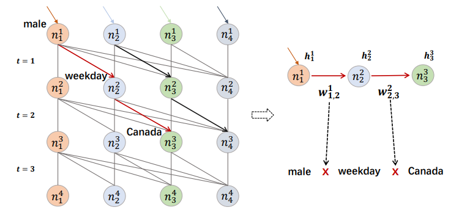

## MCCLK
### Dataset
- Book-Crossing
   - book 
- MovieLens-1M
- LastFM
- Metric
  - CTR: AUC, F1
  - top-K: Recall@K∈{5, 10, 20, 50, 100}
- 适用数据：sparse, interaction + attribute data

以下是几个比较老的模型：
## MKR
### Overview
- [Multi-Task Feature Learning for Knowledge Graph Enhanced Recommendation](https://recbole.io/docs/user_guide/model/knowledge/mkr.html)

- 结合KG embedding + 推荐两个任务
  - connected by Cross&compress Unit
    - Cross: item和entity做cross product，生成交叉特征矩阵
    - Compress: 两种cross product加权，输出到下一层
  - Recommender模块，KG模块
    - L层MLP后做Cross&compress

### Dataset
- MovieLens-1M
- Book-Crossing
- LastFM
- Bing-News
- Metric
  - CTR: AUC, Accuracy
  - top-K: Precision@K={2, 5, 10, 20, 50}
- 适用数据：sparse, side info（文本，e.g. 电影/图书名称，新闻标题）

## KGCN
### Overview
- [Knowledge Graph Convolutional Networks for Recommender](https://recbole.io/docs/user_guide/model/knowledge/kgcn.html)
- 和之前的工作大同小异
  - 基本Pipeline：
    - 聚合neighbor信息（各种aggregator，GNN）
    - 建模高阶关系（multiple-hop）
    - 定义score机制计算概率，e.g. MLP, 内积

### Dataset
- MovieLens-20M
- Book-Crossing
- LastFM
- Metric
  - AUC
  - F1
  - Recall@K={1, 2, 5, 10, 20, 50, 100}
- 适用数据：与前面几个模型相同

## KGNNLS
### Overview
- [Knowledge-aware Graph Neural Networks with Label Smoothness Regularization for Recommender Systems](https://recbole.io/docs/user_guide/model/knowledge/kgnnls.html)

- 将KG转换为user-specific的加权图，用GNN计算每个user对应的item embedding
  - 把KG看作无向图
  - 边权重可训练
- 标签平滑假设：使用标签平滑正则化，确保知识图谱中相邻item有相似的用户相关性label
  - 相当于图上的标签传播
  - 把某一item看作unlabeled
    - 用其他所有实体信息predict出一个label.
    - 在与实际label做cross entropy作为正则项

### Dataset
- MovieLens-20M (movie)
- Book-Crossing (book)
- LastFM (music)
- Dianping-Food (restaurant)
  - 大众点评数据
- Metric
  - top-k: Recall@{2, 10, 50, 100}
  - CTR: AUC
- 适用数据：交互数据，实体关系

# Context-aware
## EulerNet
### Overview
- [Adaptive Feature Interaction Learning via Euler’s Formula for CTR Prediction](https://recbole.io/docs/user_guide/model/context/eulernet.html)

- 用欧拉公式在复向量空间中建模特征交互
  - exponential -> 模和相位linear combination
- 统一捕捉显式和隐式交互，相互增强
- 自适应地学习特征交互阶数

### Dataset
- Criteo
  - 7天用户日志，CTR
- Avazu
  - CTR as well
- MovieLens-1M
- Metric
  - AUC
  - Logloss
- 适用数据：稀疏，高维特征数据（e.g. 用户行为日志中提取的多字段特征）

## FiGNN
### Overview
- [Modeling Feature Interactions via Graph Neural Networks for CTR Prediction](https://recbole.io/docs/user_guide/model/context/fignn.html)

- 解决问题：现有方法简单拼接字段embedding
- 多字段特征表示为图
  - raw feature先过self-attn
  - 随后接传统GNN pipeline
    - 状态聚合 -> 状态更新（GRU，残差）

### Dataset
- Criteo
- Avazu
- Metric
  - AUC
  - Logloss
- 任务：CTR
- 适用数据：
  - 多字段分类特征数据
  - 稀疏，高维特征
  - 正负样本不平衡

## KD_DAGFM
### Overview
- [Directed Acyclic Graph Factorization Machines for CTR Prediction via Knowledge Distillation](https://recbole.io/docs/user_guide/model/context/kd_dagfm.html).

- “基于知识蒸馏的有向无环图因子分解机”
- 用知识蒸馏从复杂的教师模型向轻量级学生模型传递知识
  - loss为均方误差
- 用dp思想传播hidden state
  - 每个k阶特征交互可以对应到第一层的唯一路径
  - 每个传播层，每个节点聚合所有邻居的状态

- 改进模型：KD-DAGFM+
  - 用于蒸馏显式和隐式特征交互
  - 最后加MLP
  - 教师模型使用xDeepFM，DCNV2，AutoInt+，FiBiNet

### Dataset
- Criteo
  - CTR benchmark
- Avazu
- MovieLens-1M
- WeChat
- Metric
  - AUC
  - Log Loss
- 适用数据：
  - CTR相关
    - u-i交互，用户画像，item特征
    - 大规模工业数据
    - 高维，稀疏，noisy

## AutoInt
### Overview
- [Automatic Feature Interaction Learning via Self-Attentive Neural Networks](https://recbole.io/docs/user_guide/model/context/autoint.html)

- Attention is all you need!
- 把数值和分类特征映射到同一低维空间
- 多头自注意力，残差连接

### Dataset
- Criteo
- Avazu
- KDD12
  - KDDCup 2012
- MovieLens-1M
- Metric
  - AUC
  - Logloss
- 适用数据：
  - 稀疏，高维
  - 包含数值和分类特征

## DCN
### Overview
- [Deep & Cross Network for Ad Click Predictions](https://recbole.io/docs/user_guide/model/context/dcn.html)

- Deep: MLP
- Cross Network: 每一层显式应用特征交叉，自动计算所有可行的特征组合
- Scalability↑；发现New item

### Dataset
- Criteo
- Metric
  - Logloss
- 适用数据：和上述几个模型相似

## DCN V2
### Overview
- 对DCN的工业级应用改进
- 用低秩结构近似特征交叉，实现更好的性能和延迟的rade-off
- 混合专家架构（MoE），把矩阵分解到多个子空间中，再用gating机制聚合

### Dataset
- Criteo
- MovieLen-1M
- Metric
  - Logloss
  - AUC
- 适用数据：
  - 大型稀疏特征，web-scale生产数据
  - 低秩结构
    - 权重矩阵具有较大的奇异值差距 / 快速的spectrum decay模式
  - 其他相似

## DIEN
### Overview
- [Deep Interest Evolution Network for Click-Through Rate Prediction](https://recbole.io/docs/user_guide/model/context/dien.html)

- 解决问题：
  - 用户行为背后的隐藏兴趣
  - 兴趣随时间变化
- w/ sequential model
- AUGRU: GRU with attentional update gate
  - 用注意力得分缩放更新门的所有维度，确保与目标item关系较弱的兴趣对隐藏状态的影响较小
  

### Dataset
- Amazon
  - Books
  - Electronics
- Industrial Dataset
- Metric
  - AUC
- 适用数据：
  - 用户行为数据
  - 多样特征类别
  - 目标商品点击信息

## DIN
### Overview
- [Deep Interest Network for Click-Through Rate Prediction](https://recbole.io/docs/user_guide/model/context/din.html)

- 固定长度表达能力不强，与candidate ad无关
- 局部激活单元（local activation unit）
  - 自适应地从用户历史行为中学习ad-specific的兴趣表示
- Two techniques:
  - 小批量正则化
    - 只计算每个mini-batch中出现的特征参数的L2范数
  - 数据自适应激活函数
    - Dice
    - PReLU的推广
    - 根据输入数分布自适应调整整流点（均值）
  
### Dataset
- Amazon(Electronics)
- MovieLens
- Alibaba
- Metric
  - AUC
  - RelaImpr (relative improvement)
  
- 适用数据：
  - pratical: 阿里广告系统
  - 大规模工业级稀疏数据

## WideDeep
Already discussed previously in EasyRec

## DSSM
- 双塔召回
- Previously discussed 
ABCDEFG
